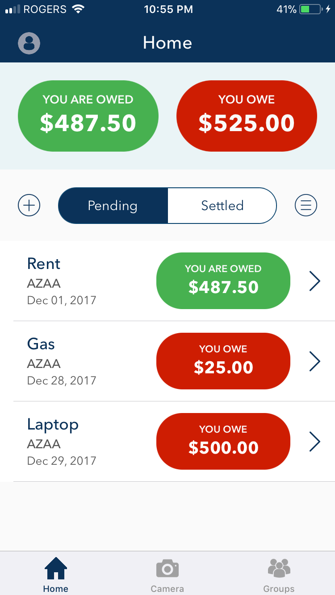
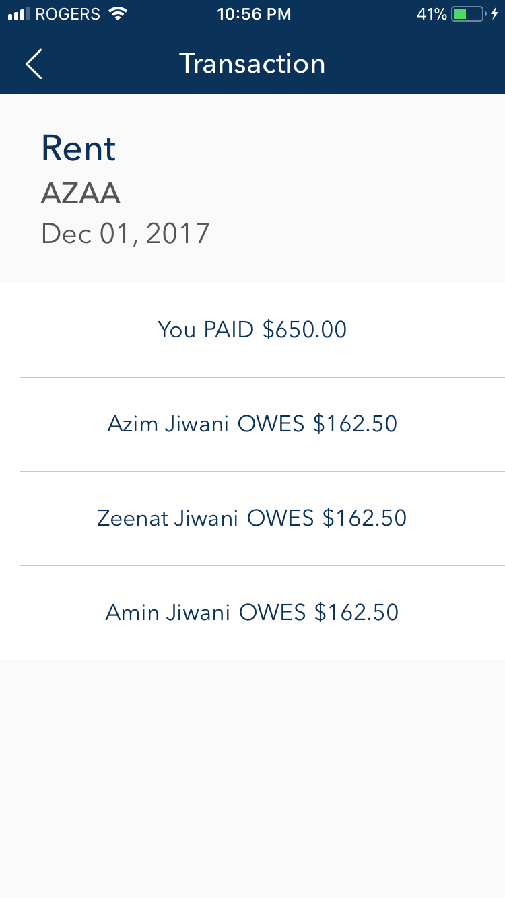
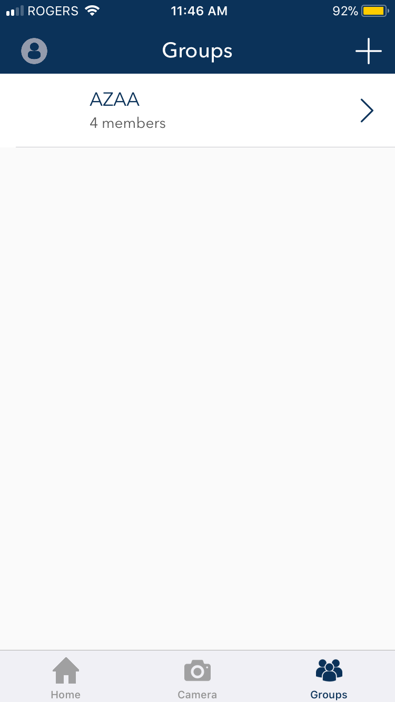
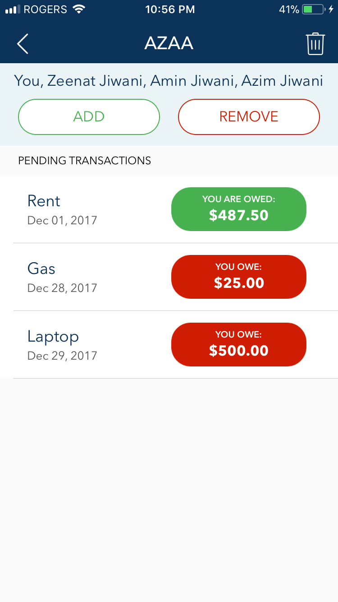
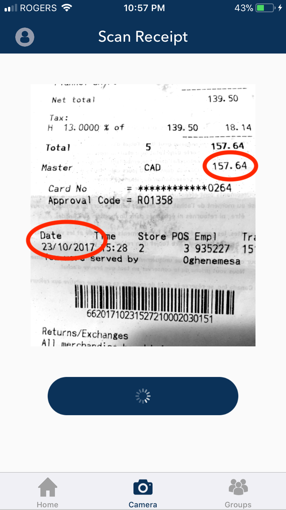
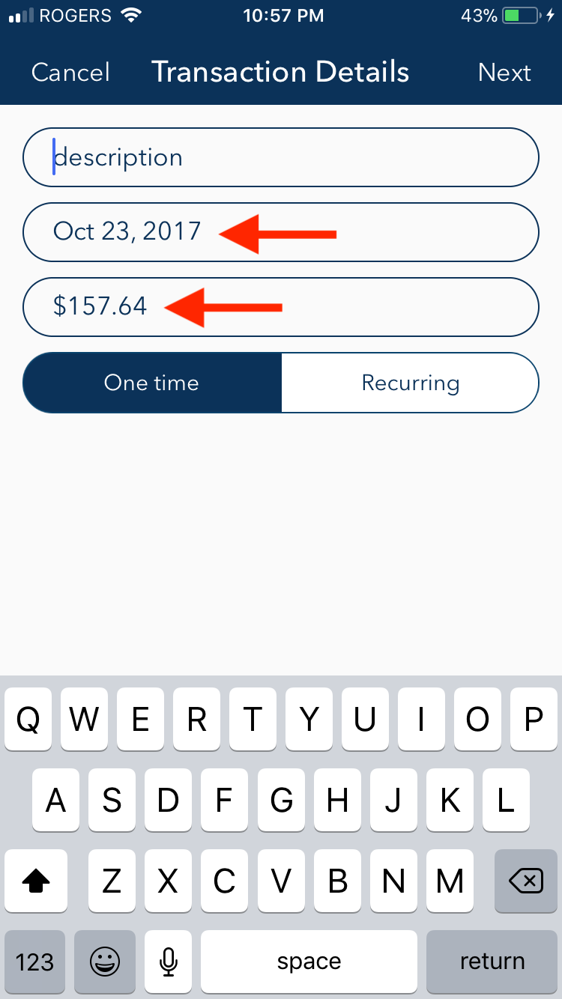

# Dime0.5

This was my first attempt in 2017 at building an iOS application that became the groundwork for a new
application called Dime 1.0 built with my friends Dhruv Patel, Shehab Salem, Mahad Zaryab, and Taher Anky 
during Summer 2019.

Dime 1.0 (a financial product built using Flutter) became Dime 2.0, which was a pivot our team did in order to attract initial users to acquire some funding for the financial product.

Both Dime 1.0 and 2.0 are private repositories; however, Dime 2.0 is available here: www.getdime.ca

View a breakdown of each transaction.

View your groups.

Check all the transactions in your group.

Take a picture of a receipt and make sure the date and the total are visible.

Divide will use OCR and NLP to read your receipt

